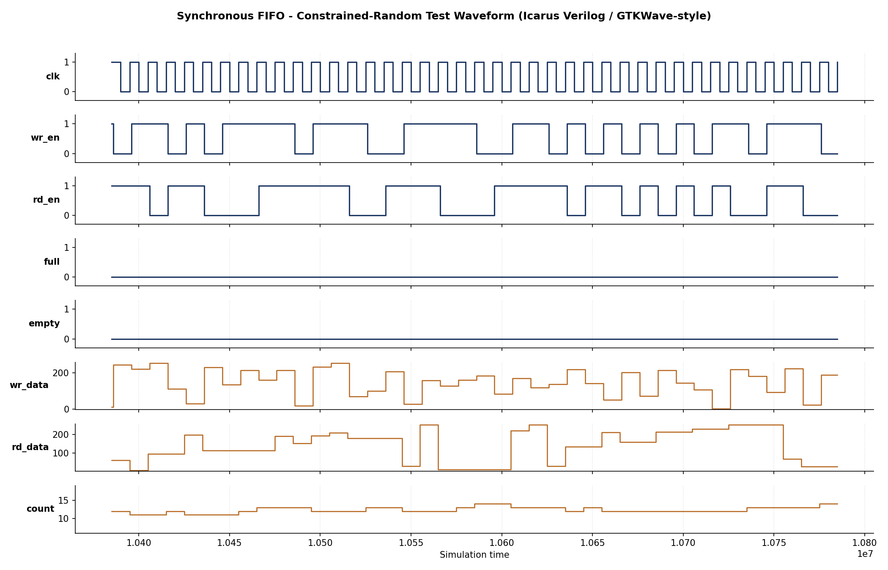

# Synchronous FIFO with Constrained-Random Verification Environment

A parameterized synchronous FIFO (RTL) paired with a self-checking,
constrained-random verification environment — built to practice
industry-style verification methodology (reference model, scoreboard,
functional coverage, assertions) on a design that shows up in almost
every real SoC.

## Design (`rtl/sync_fifo.v`)

- Parameterized `DATA_WIDTH` and `DEPTH` (depth must be a power of 2)
- Binary pointer scheme with an extra MSB wrap bit to distinguish
  full from empty without extra state
- `full`, `empty`, `almost_full`, `almost_empty`, and `count` status outputs
- Overflow / underflow protection — illegal writes/reads are silently
  dropped and flagged via `overflow` / `underflow` pulses
- Immediate assertions checking: no write-while-full, no read-while-empty,
  count never exceeds depth, full and empty never asserted together

## Verification Environment (`tb/tb_sync_fifo.v`)

- **Reference model:** an independent array-based circular buffer that
  mirrors expected FIFO contents, decoupled from the DUT's internal
  pointer implementation
- **Scoreboard:** compares every registered read against the reference
  model's predicted value, with pre-edge accept/reject decisions computed
  once and reused consistently (avoids a classic race between combinational
  `full`/`empty` sampling and the same-cycle read/write that changes them)
- **Constrained-random stimulus:** 2,000 cycles of randomized `wr_en` /
  `rd_en` / data (55% write probability, 55% read probability, independently)
- **Directed corner-case tests:** fill-to-full, write-while-full,
  drain-to-empty, read-while-empty, simultaneous read+write in steady
  state, and simultaneous read+write while full
- **Functional coverage:** 10 tracked bins covering full, empty,
  almost-full, almost-empty, simultaneous R/W, rejected writes/reads,
  and back-to-back write/read bursts

## Results

Simulated with Icarus Verilog 12.0.

```
[TEST] Directed: Fill FIFO completely, verify FULL flag
  PASS: FIFO correctly reports FULL after 16 writes
[TEST] Directed: Attempt write while FULL (should be rejected)
  PASS: overflow flag correctly asserted
[TEST] Directed: Drain FIFO completely, verify EMPTY flag
  PASS: FIFO correctly reports EMPTY after full drain
[TEST] Directed: Attempt read while EMPTY (should be rejected)
  PASS: underflow flag correctly asserted
[TEST] Directed: Simultaneous read+write in steady state
  PASS: simultaneous read/write cycles executed
[TEST] Directed: Simultaneous read+write while FULL
  PASS: simultaneous read/write while full cycles executed
[TEST] Constrained-random: 2000 cycles of randomized wr_en/rd_en/data

FUNCTIONAL COVERAGE REPORT
  Coverage bins hit: 10 / 10 (100.0%)

SCOREBOARD SUMMARY
  Total data checks performed   : 1080
  Writes accepted                : 1098
  Reads accepted                 : 1080
  Overflow (rejected write) evts : 48
  Underflow (rejected read) evts : 23
  TOTAL ERRORS                   : 0
  RESULT: *** ALL CHECKS PASSED ***
```

**Summary: 6/6 directed tests passed, 1,080/1,080 randomized data-integrity
checks passed (0 errors), 100% functional coverage across all 10 tracked
corner-case bins.**

### Waveform



*A representative window of the constrained-random test, showing
`wr_en`/`rd_en` toggling, `wr_data`/`rd_data` moving correctly, and
`count` tracking FIFO occupancy in real time.*

## A verification bug worth mentioning

Early runs of this testbench showed hundreds of false data mismatches.
The root cause wasn't the RTL — it was a classic testbench race: sampling
`full`/`empty`/`rd_data` immediately after `@(posedge clk)` can race
against the DUT's own non-blocking (`<=`) updates on that same edge,
depending on simulator event-region ordering. Fixed by inserting a small
delay (`#1`) after each clock edge before sampling DUT outputs, and by
capturing accept/reject decisions **once**, before the edge, and reusing
them consistently in the scoreboard rather than re-deriving them from
already-updated post-edge signals. This is a good example of why a
self-checking environment with a reference model catches things that
"eyeballing waveforms" would miss — and also why the checker itself has
to be built as carefully as the RTL.

## How to run

```bash
iverilog -g2012 -o sim/sync_fifo_tb.vvp rtl/sync_fifo.v tb/tb_sync_fifo.v
vvp sim/sync_fifo_tb.vvp
```

## Repository structure

```
rtl/    sync_fifo.v          - synchronous FIFO design
tb/     tb_sync_fifo.v       - self-checking verification environment
sim/    simulation_output.log - full simulation log
docs/   waveform_screenshot.png - timing diagram
```

## Tools used

Icarus Verilog 12.0 (open-source simulator). The verification concepts
(reference model, scoreboard, constrained-random stimulus, functional
coverage, assertions) map directly onto commercial flows using
QuestaSim/VCS with SystemVerilog/UVM.

---
*Author: N C Shobha*
